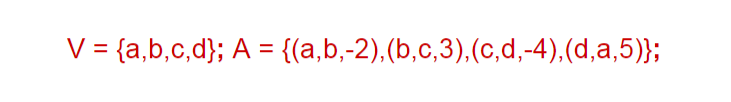

# Trabalho pratico de grafos 2024-1

  
Tabela de conteúdos

  <ol>
    <li>
      <a href="#decisões-tomadas">Decisões do projeto</a>
    </li>
    <li>
      <a href="#como-rodar">Como rodar</a>
      <ul>
        <li><a href="#pré-requisitos">Pré-requisitos</a></li>
        <li><a href="#especificações-do-arquivo-de-input-do-grafo">Especificações do arquivo de input do grafo</a></li>
        <li><a href="#rodando-o-projeto">Rodando o projeto</a></li>
      </ul>
    </li>
  </ol>

## Decisões tomadas

### Input: Grafo ponderado ou não, Grafo direcionado ou não

Como precisavamos que o grafo pudesse ser ponderado ou não, direcionado ou não e isso depende do arquivo `.txt.` de input, resolvemos receber o grafo da mesma forma, não importanto cada uma destas característas, e lidar com estas características conforme necessário.

Por exemplo, se o grafo não é ponderado (não possui peso nas arestas), atribuímos um valor `1`.

Portanto, para sabermos se o grafo é:

- Ponderado: temos o método `isPonderado` que verifica se existe pelo menos uma aresta que não possui peso 1
- Direcionado: termos o método `isDirecionado`, onde se houver pelo menos uma aresta que não tem a sua inversa, retorna true

## Como rodar

### Pré-requisitos

- JDK 21^
- Para utilizar com VSCode: [Extension pack for java](https://marketplace.visualstudio.com/items?itemName=vscjava.vscode-java-pack)

### Especificações do arquivo de input do grafo

O grafo a ser analizado estará em um arquivo .txt, e deve ser representado como no exemplo a baixo, seguindo as regras de chaves ‘{‘ ‘}’ para representar o conjunto, e finalizar com ponto e virgula ‘;’. Exemplo:

O arquivo a ser lido (com um exemplo pré-definido) é o [`grafo.txt`](./grafo.txt) na raiz do projeto

### Rodando o projeto

1. Configure o [arquivo `.txt`](#especificações-do-arquivo-de-input-do-grafo) conforme necessário
2. Com VSCode e as extensões para Java instaladas, abra o arquivo principal [Main.java](./src/Main.java)
3. Logo acima do método `main`, clique em `Run`
  